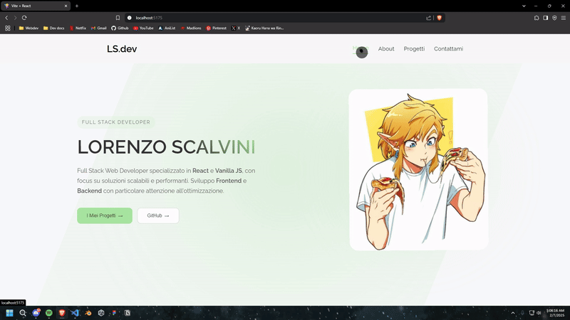

# ⚙️ Registro di Sviluppo del Portfolio (W.I.P)

  

<<<<<<< HEAD
## 📃 Panoramica del Progetto
=======
## Panoramica del Progetto
>>>>>>> e5276563f7552839250866b81821ef1d7a12319c

Questo progetto mira a creare un sito web di portfolio personale per mostrare le mie competenze, progetti ed esperienze. Il portfolio includerà sezioni come:

## 📃 Tecnologie Utilizzate

## 📃 Obiettivi

- Creare un design visivamente attraente e responsivo.
- Assicurare che il sito sia facile da navigare e user-friendly.
- Evidenziare efficacemente il mio miglior lavoro e le mie competenze.
- Implementare le migliori pratiche per lo sviluppo web, inclusa l'accessibilità e l'ottimizzazione delle prestazioni.

## 📃 Piani Futuri

- Completare le sezioni "Progetti", "Contattami" e "About".
- Ottimizzare il sito web per prestazioni e accessibilità.
- Distribuire il sito web e raccogliere feedback per ulteriori miglioramenti.
